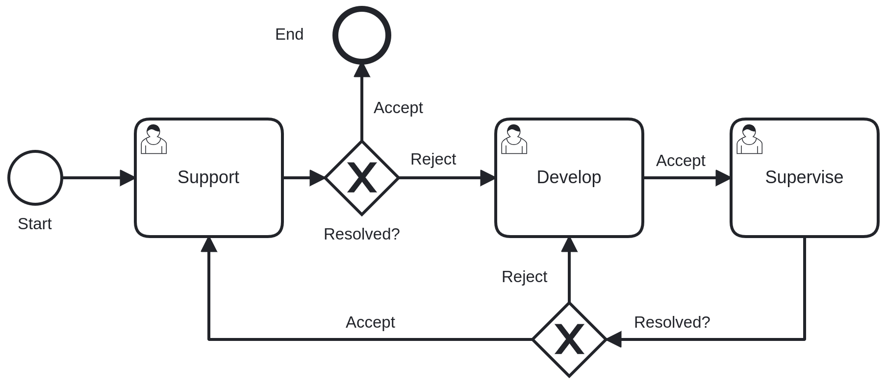

## 🎫 Ticketing System
A demonstration project that showcases: 
- A product-based ticketing system for company support
- Workflow design built from scratch and modeled using BPMN 2.0
- A structured backend/frontend built with Serenity (TypeScript + .NET Core)
 
🧩 Features 
- Ticket creation & tracking
- Workflow state transitions
- Product-based ticket categorization
- Admin management panel
- BPMN-compatible workflow modeling
- Dockerized deployment

## 📚 Workflow Overview
The following diagram represents the ticket lifecycle and workflow process:
<p>  </p>

## 🚀 Running the Project

```bash
$ dotnet restore
$ dotnet build
$ dotnet run

# Docker
$ docker-compose up --build
```

# 🏗️ Tech Stack
- Backend: ASP.NET Core
- Frontend: TypeScript
- Framework: Serenity
- Database: (PostgreSQL / SQL Server)
- Containerization: Docker & Docker Compose
